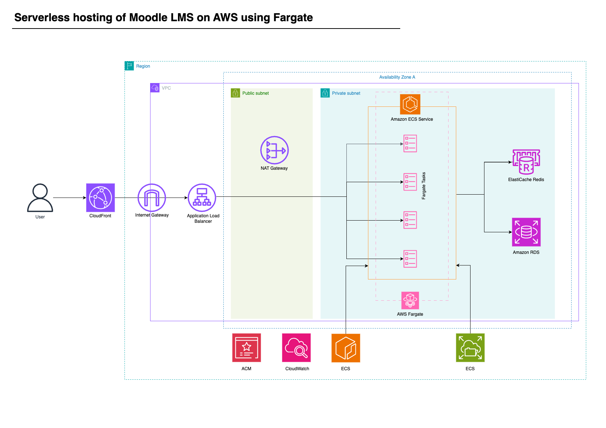

# Scalable Moodle Deployment on AWS ECS Fargate

This project provides an AWS CDK application for deploying a scalable Moodle installation using Amazon ECS Fargate, RDS, ElastiCache, and CloudFront.


## Architecture



## Project Description

This AWS CDK application automates the deployment of a highly available and scalable Moodle learning management system. It leverages various AWS services to create a robust infrastructure:

- Amazon ECS Fargate for running Moodle containers
- Amazon RDS for MySQL database
- Amazon ElastiCache for Redis caching
- Amazon EFS for shared file storage
- Application Load Balancer for traffic distribution
- Amazon CloudFront for content delivery
- AWS WAF for web application firewall protection

The infrastructure is designed with security and scalability in mind, utilizing VPC endpoints, security groups, and auto-scaling capabilities. It also includes CloudTrail for auditing and SNS notifications for RDS events.


## Data Flow

The request data flow through the application is as follows:

1. User requests are first received by CloudFront
2. CloudFront forwards requests to the Application Load Balancer
3. The ALB distributes requests to ECS Fargate tasks running Moodle
4. Moodle containers process requests, interacting with:
   - RDS MySQL for database operations
   - ElastiCache Redis for caching
   - EFS for shared file storage
5. Responses flow back through the ALB and CloudFront to the user

```
[User] <-> [CloudFront] <-> [ALB] <-> [ECS Fargate (Moodle)]
                                       |
                                       ├─ [RDS MySQL]
                                       ├─ [ElastiCache Redis]
                                       └─ [EFS]
```

Note: The WAF is integrated with CloudFront to provide an additional layer of security.

## Infrastructure

The main infrastructure components defined in the CDK stacks include:

- VPC:
  * 2 public subnets and 2 private subnets
  * NAT Gateways for outbound internet access from private subnets
  * VPC Endpoints for ECR and S3

- ECS:
  * Fargate cluster
  * Task definition for Moodle container
  * ECS Service with auto-scaling

- RDS:
  * MySQL instance for Moodle database
  * Event subscription for notifications

- ElastiCache:
  * Redis instance for caching

- EFS:
  * File system for shared Moodle data

- Application Load Balancer:
  * Distributes traffic to ECS tasks

- CloudFront:
  * Content delivery network

- WAF:
  * Web Application Firewall integrated with CloudFront

- CloudTrail:
  * Audit logging to S3 bucket

- IAM:
  * Roles and policies for ECS tasks and other resources