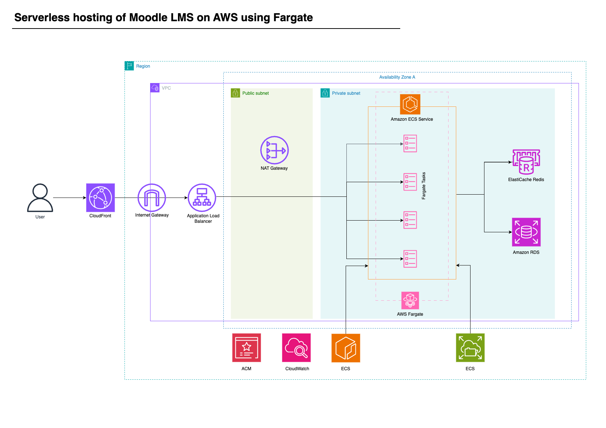

# Serverless hosting of Moodle LMS on AWS using Fargate
-------------------------------------------------------

### Architecture



### Prerequisites

1. [Install and configure AWS Command Line Interface (AWS CLI) with your AWS Identity and Access Management (IAM) user](https://docs.aws.amazon.com/cli/latest/userguide/cli-chap-getting-started.html).

2. [Install AWS CDK](https://docs.aws.amazon.com/cdk/v2/guide/getting_started.html#getting_started_install).

3. [Install Docker](https://docs.docker.com/engine/install/).

4. [Install Git](https://git-scm.com/book/en/v2/Getting-Started-Installing-Git).

5\. Pull the source code into your machine by running the following in your terminal:git clone https://github.com/aws-samples/aws-cdk-ecs-refarch-moodle.git

### Setting up domain name and TLS certificate

1\. Set up a public domain name to request a public certificate in ACM. If you don’t have a public domain name yet, you can use [Amazon Route 53](https://aws.amazon.com/route53/) to [register a new domain](https://docs.aws.amazon.com/Route53/latest/DeveloperGuide/domain-register.html). This domain name is also used for CloudFront alternative domain name.

2. [Request two public certificates](https://docs.aws.amazon.com/acm/latest/userguide/gs-acm-request-public.html) for your domain name using ACM. The first one is for the ALB where this solution is deployed (e.g. ap-southeast-1); the second one is for the CloudFront in the us-east-1 Region. For example: moodle.example.com or \*.example.com. Note the certificate Amazon Resource Names (ARNs) to be used in the deployment steps.

### Publishing Moodle container image to Amazon ECR

Prior to deploying the solution, you must first build the Moodle container image locally and publish it into a container registry such as Amazon ECR or an external registry of your choice. In this case, I use Amazon ECR.

1\. Open your preferred command line interface (CLI) such as Terminal or Command Prompt.

2\. From the top directory of the source code, run the following to build the container image:

```
docker build -t moodle-image src/image/src
``` 
or 
```
docker pull bitnami/moodle:latest
```

3\. Authenticate to your default AWS account registry:
```
aws ecr get-login-password --region us-east-1 | docker login --username AWS --password-stdin 024848486969.dkr.ecr.us-east-1.amazonaws.com
```

4\. Create a new ECR Repository to hold the image:
```
aws ecr create-repository --repository-name moodle-image --region us-east-1
```

5\. Tag the image to push to your repository:
```
docker tag moodle-image:latest 024848486969.dkr.ecr.us-east-1.amazonaws.com/moodle-image:latest
```
or 
```
docker tag bitnami/moodle:latest 024848486969.dkr.ecr.us-east-1.amazonaws.com/moodle-image:latest
```


6\. Push the image:
```
docker push 024848486969.dkr.ecr.us-east-1.amazonaws.com/moodle-image:latest
```

### Deployment steps

1\. Configure the context in the file src/cdk/cdk.json.

a. Configure app-config/albCertificateArn and app-config/cfCertificateArn with the ACM certificate ARN.

b. Configure the app-config/cfDomain for CloudFront with the same domain name as the public certificates that you’ve requested during the prerequisites step. For example: moodle.example.com.

c. Configure the app-config/moodleImageUri with the Moodle container image URI that you’ve pushed prior to deployment steps, for example ```024848486969.dkr.ecr.us-east-1.amazonaws.com/moodle-image:latest```.

2\. Go to the AWS CDK app directory cd src/cdk and then run ``` npm install ```


3\. Run ```cdk bootstrap``` to bootstrap CDK toolkit.

4\. Run ```cdk deploy --all``` to deploy the CDK app.

5\. Once successfully deployed, Moodle begins first-time installation and it takes approximately 15-20 minutes. Check the progress by checking at the logs in Amazon ECS console.

6\. Once it is completed, you can access the application endpoint on the ALB endpoint described in the deployment output APPLICATIONLOADBALANCERDNSNAME

### Post-deployment steps

1\. (Optional) You can configure a DNS record to map into the ALB endpoint to clear the SSL warning.

2\. Use the username described in MOODLEUSERNAME output and fetch the password on AWS Secrets Manager with the ARN described in the MOODLEPASSWORDSECRETARN output.

3\. To improve Moodle application performance, configure Moodle caching using the Amazon ElastiCache Redis endpoint described in the MOODLEREDISPRIMARYENDPOINTADDRESSANDPORT output.

a. Add the cache store instance using the Amazon ElastiCache Redis endpoint. Refer to the official Moodle documentation for [Adding cache store instances](https://docs.moodle.org/311/en/Caching#Adding_cache_store_instances).

b. Set the Application cache to use the Redis cache store instance that was added in the previous step. Refer to the official Moodle documentation for [Setting the stores that get used when no mapping is present](https://docs.moodle.org/311/en/Caching#Setting_the_stores_that_get_used_when_no_mapping_is_present).

4\. You can scale the number of the Moodle instance replicas by configuring app-config/serviceReplicaDesiredCount context in the file src/cdk/cdk.json. You can also configure the app-config/serviceHealthCheckGracePeriodSeconds context from 1800 to 300 seconds. You can run cdk diff to view the comparison between the current version with the already-deployed version. You can then run cdk deploy --all again to apply the latest configurations.

5\. To access the Moodle application from CloudFront endpoint, you need to create a CNAME DNS record using the domain name that you set up earlier with the record value specified in CLOUDFRONTDNSNAME output. For example: moodle.example.com with value abcd1234efgh.cloudfront.net. If you are getting a 502 error, it might be that the the TLS handshake between CloudFront and ALB is failing because of the domain name in the TLS certificate for ALB does not match with the Host header forwarded from CloudFront (the Host header in this case is the domain name that you are using to access CloudFront).

### Cleanup

You should consider deleting the application infrastructure once you no longer need it to save costs. To do that, follow these steps:

1\. Open your preferred command line interface such as Terminal or Command Prompt.

2\. From the top directory of the source code, go to the CDK app directory cd src/cdk

3\. Run ```cdk destroy --all``` to delete the CDK application.